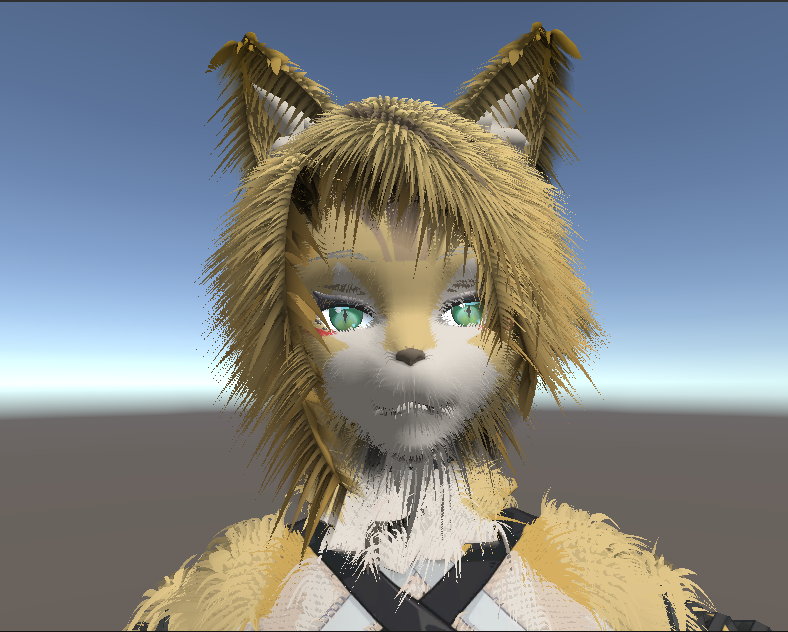
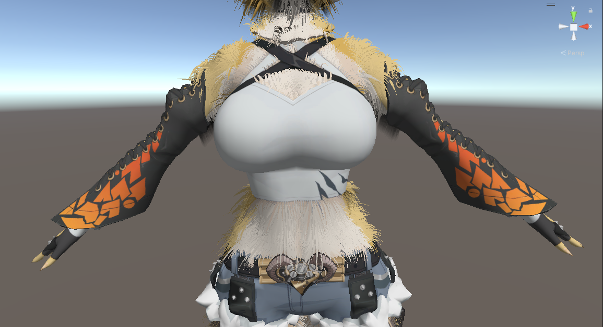
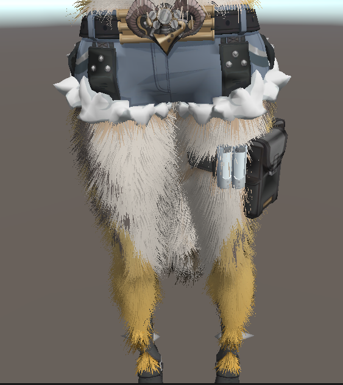
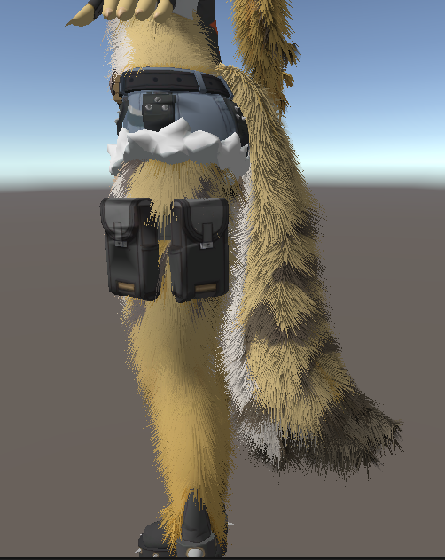

# Shell-Texturing
Generation of highly customizable fur and hair using shells and fins. For this project i also combined improvments varius different resources listen [here](##resources-used)  

## Showcase  

### Images  

## Resources Used
1)[Acerola](https://www.youtube.com/watch?v=9dr-tRQzij4&t=789s) 

2)[A Practical Guide to Generating Real-Time Dynamic Fur
and Hair using Shells](https://xbdev.net/misc_demos/demos/fur_course_notes/paper.pdf)

3)[Fur (using Shells and Fins)](https://developer.download.nvidia.com/SDK/10/direct3d/Source/Fur/doc/FurShellsAndFins.pdf)

4)[toninhoPinto](https://github.com/toninhoPinto/Shells-and-Fins#)

5)[Pulchra model from Zenless Zone Zero](https://sketchfab.com/3d-models/pulchra-zenless-zone-zero-game-character-743a408ba3f94635b33e71f2bcd882c2)
